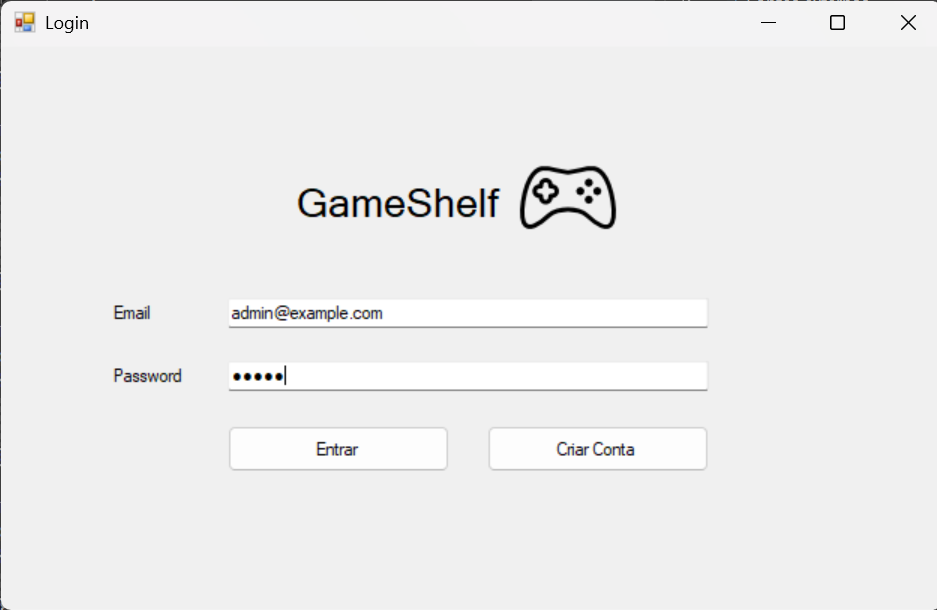

# BD: Trabalho Prático APF-T

**Grupo**: P2G3
- André Alexandre, MEC: 114143
- Tiago Melo, MEC: 113362

## Introdução / Introduction
 
GameShelf é um site de avaliações para utilizadores catalogarem videojogos e partilharem críticas (semelhante ao LetterBoxd, mas para videojogos). Escolhemos esta ideia pois ambos os elementos do grupo gostam de jogar videojogos e tal como a indústria cinematográfica, a indústria dos videojogos tem se tornado cada vez mais numa experiência que merece ser classificada por cada jogador.  
Esta ideia também permite pôr em prática vários conhecimentos adquiridos na área de Base de Dados, pois iremos ter uma gestão conjunta de jogos, críticas e utilizadores, que precisam de ser armazenados e geridos.

## ​Análise de Requisitos / Requirements

- Um utilizador pode seguir outros utilizadores (a data da sua conexão fica guardada). Cada utilizador tem um ID único, nome, email, password e número de seguidores.
- Um utilizador tem também um perfil onde é possível consultar estatísticas (p.e. género mais jogados, média de ratings atribuídos, histórico de ratings, jogos jogados), esse perfil também pode ter uma foto e uma descrição.
- Um utilizador pode fazer uma review sobre um jogo e essa review envolve dar uma classificação, uma descrição, tem também um ID único, a quantidade de horas jogadas e a data da review. Também é possível comentar ou reagir a reviews feitas por outros utilizadores, sendo que essa interação tem uma descrição(reação em si) e a data de publicação, e por fim tem também um ID único.
- O nosso sistema tem listas que não são criadas por utilizadores (p.e. Top 10 Jogos mais avaliados da semana) e listas que são criadas por utilizadores (que estão presentes no seu perfil) para gerir o estados dos jogos que acompanha (p.e. Jogados, a Jogar, Planeja Jogar) ou também criar listas dos melhores jogos (p.e. Top 10 Melhores Jogos). Cada lista para além de ter associados jogos também tem um ID único, título, descrição e visibilidade (p.e. Pública ou Privada), sendo que cada entrada na lista tem também ID único, opcionalmente ranking na lista e estado(ja jogou/ainda não jogou) e por fim notas adicionais.
- Um jogo é caracterizado por um ID único, título, data de lançamento, desenvolvedor (um ou mais, cada desenvolvedor tem um nome e um ID unico), sinopse, preço de lançamento, plataforma onde está disponível (uma ou mais, cada plataforma é definida pela sigla e ID unico), género (um ou mais, e cada género tem um nome e um ID unico), foto da capa, rating e média de horas jogadas.

## DER - Diagrama Entidade Relacionamento/Entity Relationship Diagram

### Versão final/Final version


### APFE 

Desde a última entrega reparamos que faltava o atributo que permite distinguir listas ordenadas das não ordenadas. Foi discutido implementar uma ligação IS-A, mas não nos pareceu adequado em nenhum caso do nosso projeto, pois não vemos nenhum caso em que haja a necessidade de herança de propriedades ou de relacionamentos.

## ER - Esquema Relacional/Relational Schema

### Versão final/Final Version


### APFE

Desde a última entrega reparamos que faltava o atributo que permite distinguir listas ordenadas das não ordenadas.

## ​SQL DDL - Data Definition Language

[SQL DDL File](sql/01_ddl.sql "SQLFileQuestion")

## SQL DML - Data Manipulation Language

### Página Iniciar Sessão



```sql
-- Para Login, comando para autenticar utilizador com base no seu email e password
SELECT id_utilizador, nome FROM projeto.utilizador WHERE email = @Email AND password = @Password
```


```sql
-- SP para obter as informações basicas do user (nome e foto)
projeto.sp_GetUserBasicInfo

-- SP para pesquisar entre todos os jogos
projeto.sp_SearchGames

-- SP para pesquisar pelo utilizador
projeto.sp_SearchUsers

-- SP para obter os utilizadores seguidos (amigos)
sp_GetUserFriends

-- Carregar géneros
SELECT DISTINCT nome FROM projeto.genero

-- Carregar plataformas
SELECT DISTINCT sigla FROM projeto.plataforma

-- SP para pesquisar por amigos
projeto.sp_SearchUserFriends

-- SP para Pesquisa de Listas com Filtros Combinados
projeto.sp_SearchLists
```


```sql
-- SP para carregar informações da lista
projeto.sp_GetListDetails

-- SP para obter as informações basicas do user (nome e foto)
projeto.sp_GetUserBasicInfo

-- SP para obter entradas da lista
projeto.sp_GetListEntries

-- UDF para verificar se é dono da lista
SELECT projeto.fn_IsListOwner(@userId, @listId)

-- SP para pesquisar entre todos os jogos
projeto.sp_SearchGames

-- SP para adicionar jogo a lista
projeto.sp_AddGameToList

-- SP para obter o dono da lista a partir do listId
projeto.sp_GetListOwner
```


## Normalização/Normalization

Descreva os passos utilizados para minimizar a duplicação de dados / redução de espaço.
Justifique as opções tomadas.
Describe the steps used to minimize data duplication / space reduction.
Justify the choices made.

## Índices/Indexes

Descreva os indices criados. Junte uma cópia do SQL de criação do indice.
Describe the indexes created. Attach a copy of the SQL to create the index.

```sql
-- Create an index to speed queries by XYZ in form A.
CREATE INDEX index_name ON table_name (column1, column2, ...);
```

## SQL Programming: Stored Procedures, Triggers, UDF

[SQL SPs and Functions File](sql/02_sp_functions.sql "SQLFileQuestion")

[SQL Triggers File](sql/03_triggers.sql "SQLFileQuestion")

## Outras notas/Other notes

### Dados iniciais da dabase de dados/Database init data

[SQL DB Init File](sql/04_db_init "SQLFileQuestion")

### Apresentação

[Slides](slides.pdf "Sildes")

[Video](https://elearning.ua.pt/pluginfile.php/55992/mod_label/intro/VideoTrabalho2013.mp4)


 