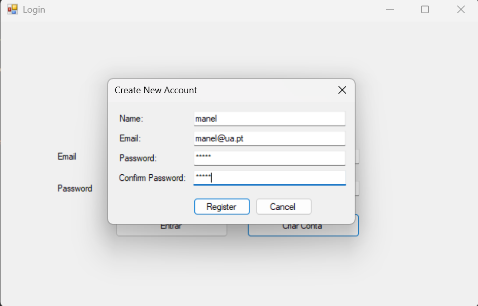
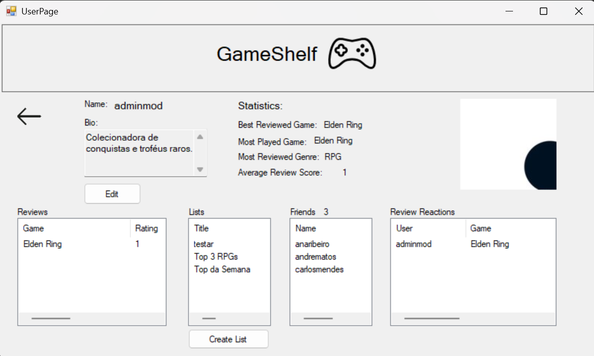
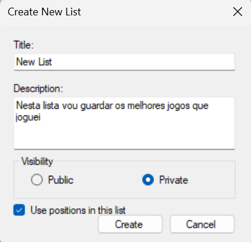
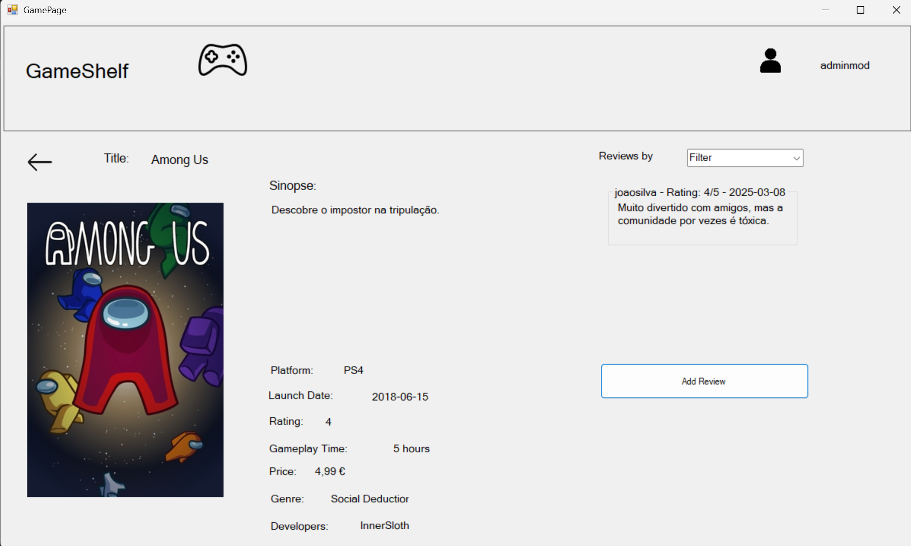
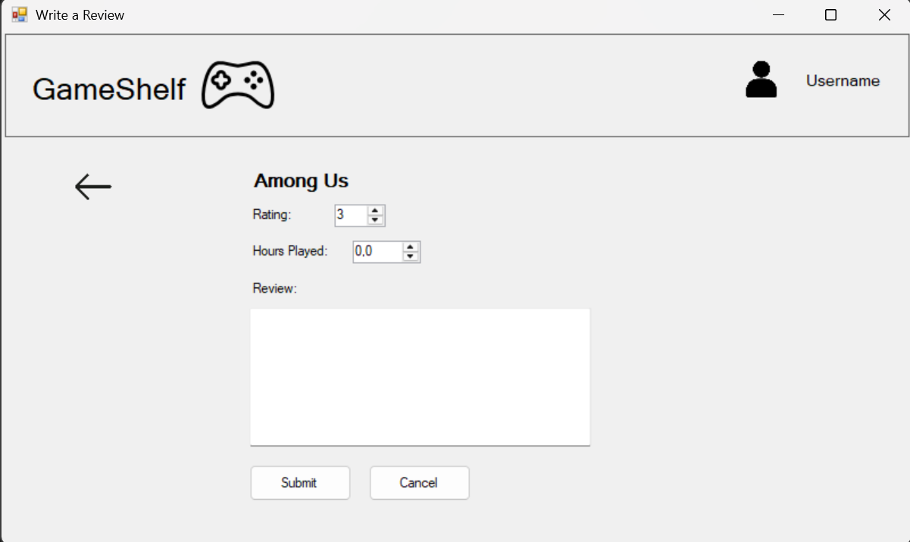
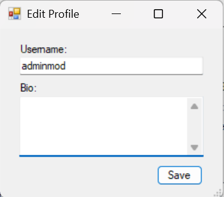

# BD: Trabalho Prático APF-T

**Grupo**: P2G3
- André Alexandre, MEC: 114143
- Tiago Melo, MEC: 113362

## Introdução / Introduction
 
GameShelf é um site de avaliações para utilizadores catalogarem videojogos e partilharem críticas (semelhante ao LetterBoxd, mas para videojogos). Escolhemos esta ideia pois ambos os elementos do grupo gostam de jogar videojogos e tal como a indústria cinematográfica, a indústria dos videojogos tem se tornado cada vez mais numa experiência que merece ser classificada por cada jogador.  
Esta ideia também permite pôr em prática vários conhecimentos adquiridos na área de Base de Dados, pois iremos ter uma gestão conjunta de jogos, críticas e utilizadores, que precisam de ser armazenados e geridos.

## ​Análise de Requisitos / Requirements

- Um utilizador pode seguir outros utilizadores (a data da sua conexão fica guardada). Cada utilizador tem um ID único, nome, email, password e número de seguidores.
- Um utilizador tem também um perfil onde é possível consultar estatísticas (p.e. género mais jogados, média de ratings atribuídos, histórico de ratings, jogos jogados), esse perfil também pode ter uma foto e uma descrição.
- Um utilizador pode fazer uma review sobre um jogo e essa review envolve dar uma classificação, uma descrição, tem também um ID único, a quantidade de horas jogadas e a data da review. Também é possível comentar ou reagir a reviews feitas por outros utilizadores, sendo que essa interação tem uma descrição(reação em si) e a data de publicação, e por fim tem também um ID único.
- O nosso sistema tem listas que não são criadas por utilizadores (p.e. Top 10 Jogos mais avaliados da semana) e listas que são criadas por utilizadores (que estão presentes no seu perfil) para gerir o estados dos jogos que acompanha (p.e. Jogados, a Jogar, Planeja Jogar) ou também criar listas dos melhores jogos (p.e. Top 10 Melhores Jogos). Cada lista para além de ter associados jogos também tem um ID único, título, descrição e visibilidade (p.e. Pública ou Privada), sendo que cada entrada na lista tem também ID único, opcionalmente ranking na lista e estado(ja jogou/ainda não jogou) e por fim notas adicionais.
- Um jogo é caracterizado por um ID único, título, data de lançamento, desenvolvedor (um ou mais, cada desenvolvedor tem um nome e um ID unico), sinopse, preço de lançamento, plataforma onde está disponível (uma ou mais, cada plataforma é definida pela sigla e ID unico), género (um ou mais, e cada género tem um nome e um ID unico), foto da capa, rating e média de horas jogadas.

## DER - Diagrama Entidade Relacionamento/Entity Relationship Diagram

### Versão final/Final version


### APFE 

Desde a última entrega reparamos que faltava o atributo que permite distinguir listas ordenadas das não ordenadas. Foi discutido implementar uma ligação IS-A, mas não nos pareceu adequado em nenhum caso do nosso projeto, pois não vemos nenhum caso em que haja a necessidade de herança de propriedades ou de relacionamentos.

## ER - Esquema Relacional/Relational Schema

### Versão final/Final Version


### APFE

Desde a última entrega reparamos que faltava o atributo que permite distinguir listas ordenadas das não ordenadas.

## ​SQL DDL - Data Definition Language

[SQL DDL File](sql/01_ddl.sql "SQLFileQuestion")

## SQL DML - Data Manipulation Language

### Página Iniciar Sessão


```sql
-- Para Login, comando para autenticar utilizador com base no seu email e password
SELECT id_utilizador, nome FROM projeto.utilizador WHERE email = @Email AND password = @Password
```

### Página Registar



```sql
-- SP para verificar se name ou email já existem
projeto.sp_CheckUserExists

-- SP para registar o novo utilizador
projeto.sp_RegisterUser

-- UDF para gerar ID unico para o utilizador
SELECT projeto.fn_GenerateUserId()
```

### Página Inicial


```sql
-- SP para obter as informações basicas do user (nome e foto)
projeto.sp_GetUserBasicInfo

-- SP para pesquisar entre todos os jogos
projeto.sp_SearchGames

-- SP para pesquisar pelo utilizador
projeto.sp_SearchUsers

-- SP para obter os utilizadores seguidos (amigos)
sp_GetUserFriends

-- Carregar géneros
SELECT DISTINCT nome FROM projeto.genero

-- Carregar plataformas
SELECT DISTINCT sigla FROM projeto.plataforma

-- SP para pesquisar por amigos
projeto.sp_SearchUserFriends

-- SP para Pesquisa de Listas com Filtros Combinados
projeto.sp_SearchLists
```

### Página Lista


```sql
-- SP para carregar informações da lista
projeto.sp_GetListDetails

-- SP para obter as informações basicas do user (nome e foto)
projeto.sp_GetUserBasicInfo

-- SP para obter entradas da lista
projeto.sp_GetListEntries

-- UDF para verificar se é dono da lista
SELECT projeto.fn_IsListOwner(@userId, @listId)

-- SP para pesquisar entre todos os jogos
projeto.sp_SearchGames

-- SP para adicionar jogo a lista
projeto.sp_AddGameToList

-- SP para obter o dono da lista a partir do listId
projeto.sp_GetListOwner

-- SP para eliminar uma entrada da lista
projeto.sp_DeleteListEntry;
```

### Página Utilizador



```sql
-- SP para carregar profile do user
projeto.sp_GetUserProfile

-- UDF para verificar se é amigo
SELECT projeto.fn_IsFriend(@currentUserId, @profileUserId)

-- SP para obter as reviews do user
projeto.sp_GetUserReviews

-- SP para obter as listas do user
projeto.sp_GetUserLists

-- SP para obter amigos (followers) do user
projeto.sp_GetUserFollowing

-- SP para obter reações a reviews feitas pelo user
projeto.sp_GetUserReviewReactions

-- SP para obter/calcular estatisticas do user
projeto.sp_GetUserGameStats

-- Comando que permita update e insert da foto de perfil do user
IF EXISTS (SELECT 1 FROM projeto.perfil WHERE utilizador = @userId)
UPDATE projeto.perfil SET foto = @photo WHERE utilizador = @userId
ELSE
INSERT INTO projeto.perfil (foto, utilizador) VALUES (@photo, @userId)

-- SP para obter informação sobre o dono da lista
projeto.sp_GetListOwner

-- Comando para adicionar amigo caso ainda não for amigo
INSERT INTO projeto.segue 
(id_utilizador_seguidor, id_utilizador_seguido, data_seguir) 
VALUES (@currentUserId, @profileUserId, GETDATE())

-- Comando para deixar se ser amigo de user
DELETE FROM projeto.segue 
WHERE id_utilizador_seguidor = @currentUserId 
AND id_utilizador_seguido = @profileUserId
```

### Página Criar lista




```sql
-- SP para criar lista
projeto.sp_CreateList

-- comando para buscar o maior valor ID
SELECT MAX(id_lista) FROM projeto.lista
```

### Página de jogo



```sql
-- SP para obter detalhes de um jogo
projeto.sp_GetGameDetails

-- comando para carregar generos do jogo
SELECT g.nome FROM projeto.genero g WHERE g.id_jogo = @gameId

-- comando para carregar desenvolvedores do jogo
SELECT d.nome FROM projeto.desenvolvedor d WHERE d.id_jogo = @gameId

-- comando para carregar plataformas do jogo
SELECT p.sigla FROM projeto.plataforma p WHERE p.id_jogo = @gameId

-- comando para carregar reviews
SELECT r.id_review, r.descricao_review, u.nome, r.rating, r.data_review
FROM projeto.review r
JOIN projeto.utilizador u ON r.id_utilizador = u.id_utilizador
WHERE r.id_jogo = @gameId

-- uso de UDF para verificar se são amigos nas reviews
AND projeto.fn_IsFriend(@currentUserId, r.id_utilizador) = 1

-- para verificar se são reviews feitas por mods
AND u.nome = 'adminmod'

-- comando para carregar nome do utilizador
SELECT nome FROM projeto.utilizador WHERE id_utilizador = @userId

-- UDF para verificar se user pode dar review a jogo
SELECT projeto.fn_CanUserReviewGame(@userId, @gameId)
```

### Página Review




```sql
-- UDF para gerar ID unico da review
SELECT projeto.fn_GenerateReviewId()

-- SP para obter detalhes do jogo
projeto.sp_GetGameDetails

-- SP para verificar se o utilizador já deu review ao jogo
projeto.sp_CheckUserGameReview

-- comando para verificar se review existe (podia também ser usada uma UDF)
SELECT COUNT(*) FROM projeto.review WHERE id_utilizador = @userId AND id_jogo = @gameId

--SP para dar update a reviews
projeto.sp_UpdateReview

-- comando para obter ids de reviews que o utilizador fez daquele jogo
SELECT id_review FROM projeto.review WHERE id_utilizador = @userId AND id_jogo = @gameId

--SP para criar reviews
projeto.sp_CreateReview
```

### Página Detalhes Review (permite reagir a review)


```sql
--SP para recolher review details
projeto.sp_GetReviewDetails 

-- SP para recolher reações a review
projeto.sp_GetReviewReactions

-- UDF para verificar se o user é o escritor daquela review
SELECT projeto.fn_IsReviewOwner(@currentUserId, @reviewId) AS isOwner

--SP para eliminar uma review
projeto.sp_DeleteReview
```

### Página Editar Perfil



```sql
-- comando para dar update ao name do utilizador
UPDATE projeto.utilizador SET nome = @name WHERE id_utilizador = @userId

-- comando para verificar se já existe um registro na tabela projeto.perfil para o utilizador  (os 3 comandos podiam ser feitos numa SP)
IF EXISTS (SELECT 1 FROM projeto.perfil WHERE utilizador = @userId) 

-- se sim atualiza a bio
UPDATE projeto.perfil SET bio = @bio WHERE utilizador = @userId 

-- caso não, insere um projeto.perfil novo, e consequentemente uma bio nova
ELSE INSERT INTO projeto.perfil (bio, utilizador) VALUES (@bio, @userId)
```

### Página Adicionar reação


```sql
--SP para recolher reacoes
projeto.sp_GetReaction

-- SP para dar manage as reacoes
projeto.sp_ManageReaction
```


## Normalização/Normalization

Passos de Normalização Implementados

1. Primeira Forma Normal (1FN)
- Tabelas individuais para cada entidade principal: Jogos Utilizadores, Reviews, Listas, etc.

- Eliminação de grupos repetitivos: Cada atributo contém apenas valores atômicos (indivisíveis).

- Chaves primárias definidas para todas as tabelas

---

2. Segunda Forma Normal (2FN)
- Remoção de dependências parciais:

    - Tabelas de relacionamento como avaliado_por, segue e reage_a foram criadas para relações muitos-para-muitos.

    - Atributos dependentes da chave completa (não apenas parte dela).

---

3. Terceira Forma Normal (3FN)
- Eliminação de dependências transitivas:

    - Informações sobre desenvolvedores, plataformas e gêneros foram separadas em tabelas próprias (desenvolvedor, plataforma, genero).

    - A tabela perfil contém informações que dependem apenas do utilizador, não de outros atributos.

## Índices/Indexes

Os indices encontram-se no ficheiro [Indexes](sql/05_any_other_matter.sql "Indexes")

1. Índice para projeto.sp_SearchGames (Pesquisa principal)

```sql
-- Esta SP faz buscas por título e filtros por rating. O índice composto acelera ambas as operações.
CREATE INDEX IX_jogo_titulo_rating ON projeto.jogo(titulo, rating_medio);
```


2. Índice para projeto.sp_GetFilteredGameReviews (Página de jogo)

```sql
-- Mostrar reviews é crítico na página de detalhes do jogo.
CREATE INDEX IX_review_jogo_usuario_data ON projeto.review(id_jogo, id_utilizador, data_review DESC);
```


3. Índice para projeto.sp_GetUserLists (Perfil do usuário)

```sql
-- Consultado frequentemente para mostrar listas no perfil, diferenciando visibilidade.
CREATE INDEX IX_lista_usuario_titulo_visibilidade ON projeto.lista(id_utilizador, titulo_lista, visibilidade_lista);
```


4. Índice para projeto.fn_IsFriend (Relações sociais)

```sql
-- Esta função é usada em múltiplas SPs para verificar relações entre usuários.
CREATE INDEX IX_segue_relacionamento ON projeto.segue(id_utilizador_seguidor, id_utilizador_seguido);
```


## SQL Programming: Stored Procedures, Triggers, UDF

[SQL SPs and Functions File](sql/02_sp_functions.sql "SQLFileQuestion")

[SQL Triggers File](sql/03_triggers.sql "SQLFileQuestion")

## Outras notas/Other notes

Algumas listas são criadas pelo admin, que servem como listas criadas pela aplicação, e quando públicas acessíveis a todos os utilizadores. Para aceder por admin podem ser usadas as credenciais:
    email: admin@example.com
    password: admin

O "name" de um seguidor funciona como um username, e é unico.
Nos IDs usamos um conjunto de caracteres, inicialmente definido como varchar(20) no ddl, então na implementação decidimos gerar um ID como se fosse uma string.

Na página do perfil, na aba "Review Reactions" apenas aparecem reações às reviews feitas pelo utilizador.

### Dados iniciais da dabase de dados/Database init data

[SQL DB Init File](sql/04_db_init "SQLFileQuestion")

### Apresentação

[Slides](Apresentação_BD_113362_114143.pdf "Slides")

[Video](demonstração.mp4)


 